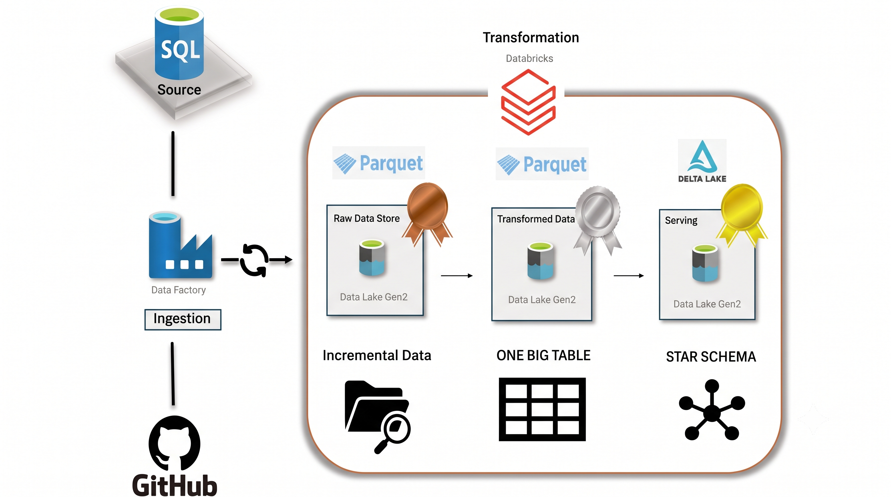
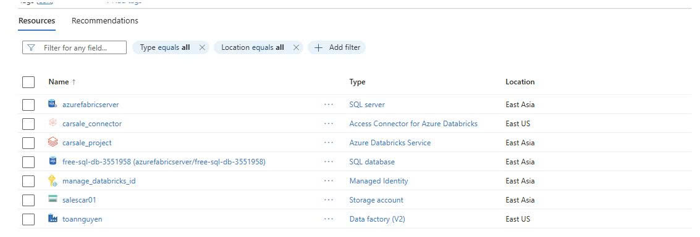
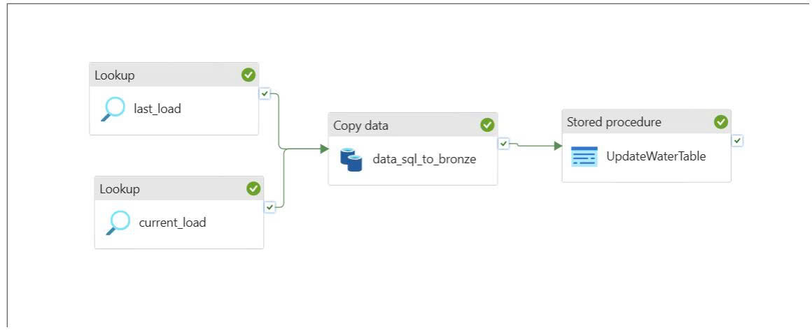
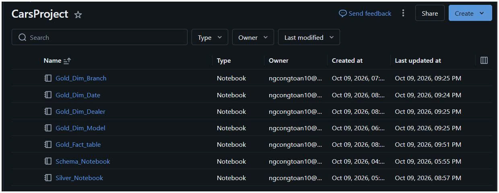
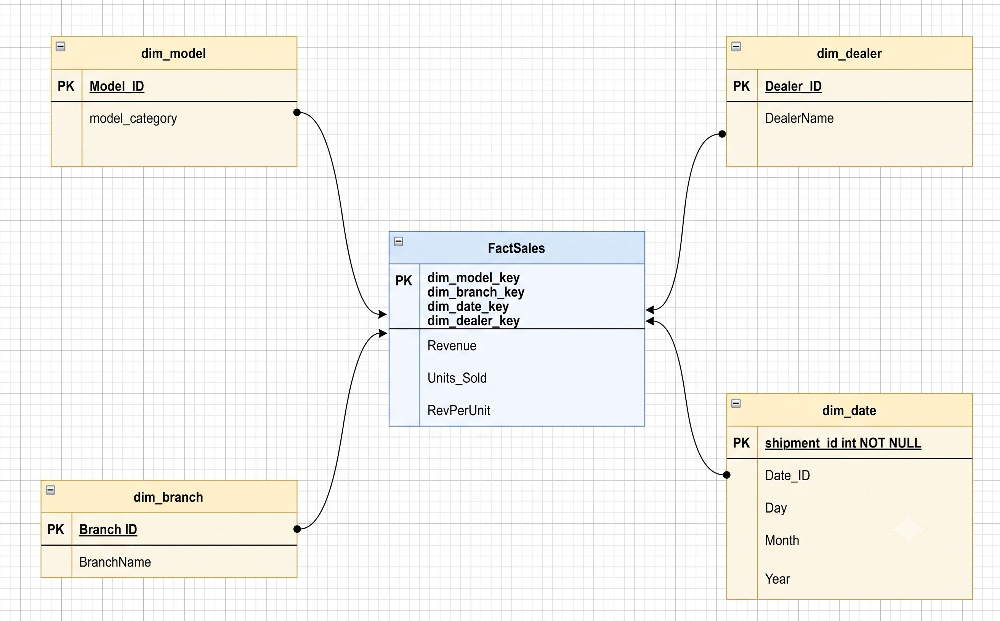
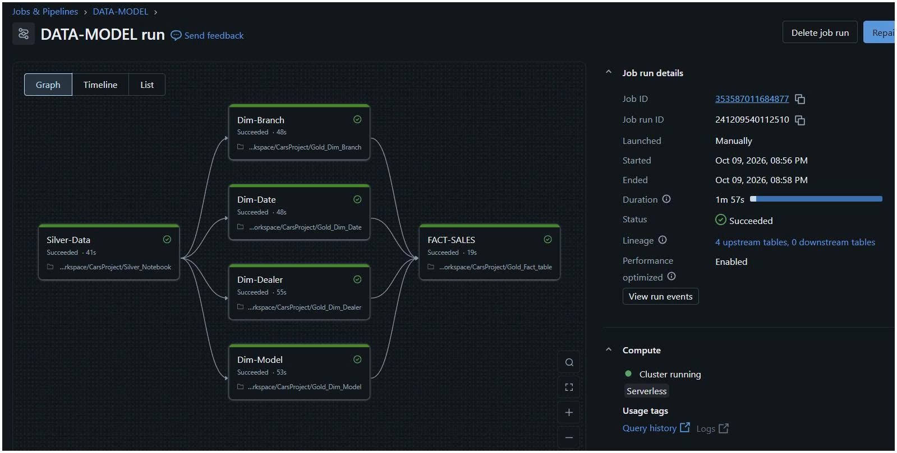

# Azure Data Engineering Project

An end-to-end data engineering project built with Microsoft Azure, Azure Data Factory, Azure Databricks, and Unity Catalog to implement a scalable data pipeline for data ingestion, transformation, and analytics.

## Project Overview

This project demonstrates how to build a modern data engineering solution on Azure, following the Medallion Architecture to organize data into Bronze, Silver, and Gold layers. 
## Architecture

## Pipeline
* **Data Ingestion:** Implement incremental data loading from Azure SQL Database and GitHub into the Bronze layer of Azure Data Lake Storage using Azure Data Factory.
* **Data Governance:** Use Unity Catalog to manage data assets, metadatastore, and access control across the Azure Cloud.
* **Data Transformation:** Use Azure Databricks and PySpark to clean, standardize, and transform data in the Silver layer.
* **Slowly Changing Dimension (SCD) Type 1:** Implement SCD Type 1 in the Gold layer to update dimension records while overwriting previous values.
* **Star Schema Design:** Design a Star Schema consisting of fact and dimension tables to support efficient analytical queries and reporting.
🥉 Bronze Layer

**Data Ingestion:** Implement incremental data loading from Azure SQL Database and GitHub into the Bronze layer of Azure Data Lake Storage using Azure Data Factory.

🥈 Silver Layer
**Data Governance:** Use Unity Catalog to manage data assets, metadatastore, and access control across the Azure Cloud.
**Data Transformation:** Use Azure Databricks and PySpark to clean, standardize, and transform data in the Silver layer.

🥇 Gold Layer
**Slowly Changing Dimension (SCD) Type 1:** Implement SCD Type 1 in the Gold layer to update dimension records while overwriting previous values.
**Star Schema Design:** Design a Star Schema consisting of fact and dimension tables to support efficient analytical queries and ready for BI and analysis

## Azure Setup

## Azure Data Factory pipeline

## Databricks Notebooks

## Star Schema Modeling

## Workflow Databricks

